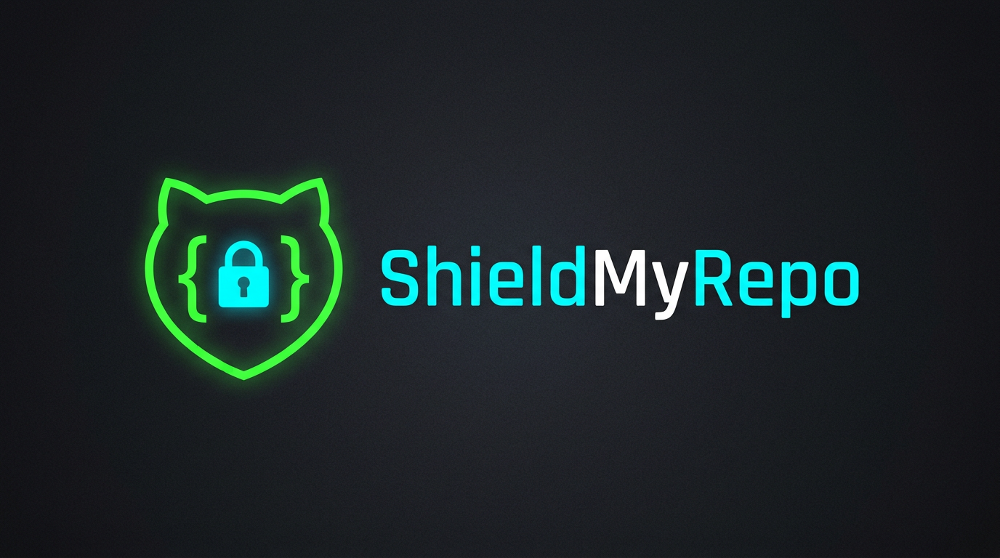

<p align="center">
  
</p>

<h1 align="center">🛡️ ShieldMyRepo</h1>

<p align="center">
  <strong>Scan any GitHub repo for security nightmares in 30 seconds.</strong>
</p>

<p align="center">
  <a href="https://github.com/DhanushNehru/ShieldMyRepo/stargazers"></a>
  <a href="https://github.com/DhanushNehru/ShieldMyRepo/network/members"></a>
  <a href="https://github.com/DhanushNehru/ShieldMyRepo/issues"></a>
  <a href="https://github.com/DhanushNehru/ShieldMyRepo/blob/main/LICENSE"></a>
  <a href="https://github.com/DhanushNehru/ShieldMyRepo/actions"></a>
</p>

<p align="center">
  <a href="#-features">Features</a> •
  <a href="#-quick-start">Quick Start</a> •
  <a href="#-scanners">Scanners</a> •
  <a href="#-report-card">Report Card</a> •
  <a href="#-badge">Badge</a> •
  <a href="#-contributing">Contributing</a>
</p>

---

## 🤔 What is ShieldMyRepo?

**ShieldMyRepo** is an open-source CLI tool that scans any code repository for security vulnerabilities, misconfigurations, and leaked secrets — then gives it a **security grade from A to F** with a shareable badge for your README.

Think of it as a **security health check** for your codebase.

```bash
$ shieldmyrepo scan .

🛡️ ShieldMyRepo — Security Report Card
━━━━━━━━━━━━━━━━━━━━━━━━━━━━━━━━━━━━━━

📊 Overall Grade: B

┌─────────────────────────┬────────┬──────────┐
│ Scanner                 │ Status │ Findings │
├─────────────────────────┼────────┼──────────┤
│ 🔑 Secret Detection     │ ✅ PASS │ 0        │
│ 📦 Dependencies         │ ⚠️ WARN │ 3        │
│ ⚙️ GitHub Actions        │ ✅ PASS │ 0        │
│ 🐳 Dockerfile           │ ❌ FAIL │ 2        │
│ 📄 Gitignore             │ ⚠️ WARN │ 1        │
└─────────────────────────┴────────┴──────────┘

📋 Details: reports/shieldmyrepo-report.json
🏷️ Badge: reports/shieldmyrepo-badge.svg
```

## ✨ Features

- 🔑 **Secret Detection** — Finds leaked API keys, tokens, passwords, and private keys in your code
- 📦 **Dependency Scanning** — Checks `package.json`, `requirements.txt`, `Cargo.toml`, `go.mod` for known vulnerabilities
- ⚙️ **GitHub Actions Audit** — Detects insecure workflow configurations and supply chain risks
- 🐳 **Dockerfile Security** — Flags running as root, unpinned base images, secrets in build args
- 📄 **Gitignore Check** — Ensures sensitive files aren't being committed
- 📊 **A-F Grade Report Card** — Beautiful terminal output with actionable recommendations
- 🏷️ **Shareable Badge** — Generate an SVG badge to show your repo's security grade in your README
- 🔌 **Plugin Architecture** — Easy to add new scanners (great for contributors!)

## 🚀 Quick Start

### Installation

```bash
# Clone the repository
git clone https://github.com/DhanushNehru/ShieldMyRepo.git
cd ShieldMyRepo

# Install in development mode
pip install -e .
```

### Usage

```bash
# Scan the current directory
shieldmyrepo scan .

# Scan a specific path
shieldmyrepo scan /path/to/your/project

# Scan and generate a badge
shieldmyrepo scan . --badge

# Output report as JSON
shieldmyrepo scan . --format json

# Run only specific scanners
shieldmyrepo scan . --scanners secrets,dockerfile
```

## 🔍 Scanners

ShieldMyRepo uses a **modular plugin architecture**. Each scanner is a self-contained Python module that can be easily added or modified.

| Scanner | Description | File |
|---------|-------------|------|
| 🔑 Secrets | Detects leaked API keys, tokens, and passwords | `scanners/secrets.py` |
| 📦 Dependencies | Checks package files for known vulnerabilities | `scanners/dependencies.py` |
| ⚙️ GitHub Actions | Audits workflow security configurations | `scanners/github_actions.py` |
| 🐳 Dockerfile | Analyzes Docker security best practices | `scanners/dockerfile.py` |
| 📄 Gitignore | Validates gitignore coverage | `scanners/gitignore.py` |

### Want to add a new scanner?

Check out our [Contributing Guide](CONTRIBUTING.md) — adding a scanner is one of the easiest ways to contribute! Each scanner is a single Python file that follows a simple interface.

## 📊 Report Card

ShieldMyRepo generates a beautiful report card with:

- **Overall Grade** (A-F) based on weighted scanner results
- **Per-scanner status** (PASS / WARN / FAIL)
- **Finding count** with severity levels
- **Actionable recommendations** for each finding
- **JSON export** for CI/CD integration

### Grading Scale

| Grade | Score Range | Description |
|-------|-----------|-------------|
| A | 90-100 | Excellent — minimal security concerns |
| B | 80-89 | Good — a few minor issues |
| C | 70-79 | Fair — some issues need attention |
| D | 60-69 | Poor — significant security gaps |
| F | 0-59 | Critical — immediate action required |

## 🏷️ Badge

Add a security grade badge to your project's README:

```markdown

```

Run `shieldmyrepo scan . --badge` to generate an SVG badge in the `reports/` directory.

## 🛠️ Tech Stack

- **Python 3.8+** — Core CLI and scanner engine
- **Click** — CLI framework
- **Rich** — Beautiful terminal output
- **PyYAML** — YAML parsing for workflows and configs

## 🤝 Contributing

We love contributions! ShieldMyRepo is designed to be **contributor-friendly**:

- 🟢 **Easy**: Add a new secret detection pattern
- 🟡 **Medium**: Build a new scanner module
- 🔴 **Hard**: Improve the grading algorithm

Check out our [Contributing Guide](CONTRIBUTING.md) to get started. Look for issues tagged with [`good first issue`](https://github.com/DhanushNehru/ShieldMyRepo/labels/good%20first%20issue) or [`help wanted`](https://github.com/DhanushNehru/ShieldMyRepo/labels/help%20wanted).

### Contributors

<a href="https://github.com/DhanushNehru/ShieldMyRepo/graphs/contributors">
  
</a>

## 📄 License

This project is licensed under the MIT License — see the [LICENSE](LICENSE) file for details.

## ⭐ Star History

If you find ShieldMyRepo useful, please consider giving it a star! It helps others discover the project.

[](https://star-history.com/#DhanushNehru/ShieldMyRepo&Date)

---

<p align="center">
  Made with ❤️ by <a href="https://github.com/DhanushNehru">Dhanush Nehru</a>
</p>
